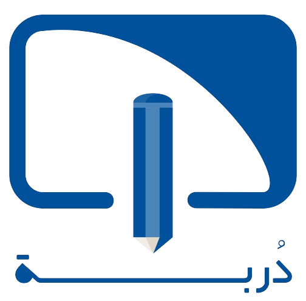

# Summer Training Management System ( Durba )


The objective of this project is to develop a customized Summer Training Management System(STMS) using web development technologies to transform the traditional methods of managing summer training into a professional and reliable approach.

## Tools we used 
- HTML , CSS(Tailwind) ,JavaScript
- PHP (Laravel framework)
- Docker 

## Installation
- How to install Docker in windows? \
Here video may help you to install Docker [Click Here](https://youtu.be/5nX8U8Fz5S0?si=SOsXhYcykGWq-tp-).
- on terminal of VS code editor write the following
```bash
docker-compose up --build
docker exec stms-fyp bash -c "composer update"
```
or
```bash
make setup
```
if you want to stop the container you can use 
```bash
docker-compose stop
```
or
```bash
make stop
```

## Add enviroment file 

inside stms-fyp folder add file name ".env" contain the content of the file name ".env.example" and change the following inside it  following (if does not exist)

```python
DB_CONNECTION=mysql
DB_HOST=mysql_db
DB_PORT=3306
DB_DATABASE=stms-fyp
DB_USERNAME=root
DB_PASSWORD=root

```
## DB migrations 
inside the database folder the database tables was created ,
to create the database run the following commands in the terminal :
```bash
docker exec stms-fyp bash -c "php artisan migrate"
```
after that the all tables should be created successfully , so you can see the phpmyadmin the all tables should be appear.
